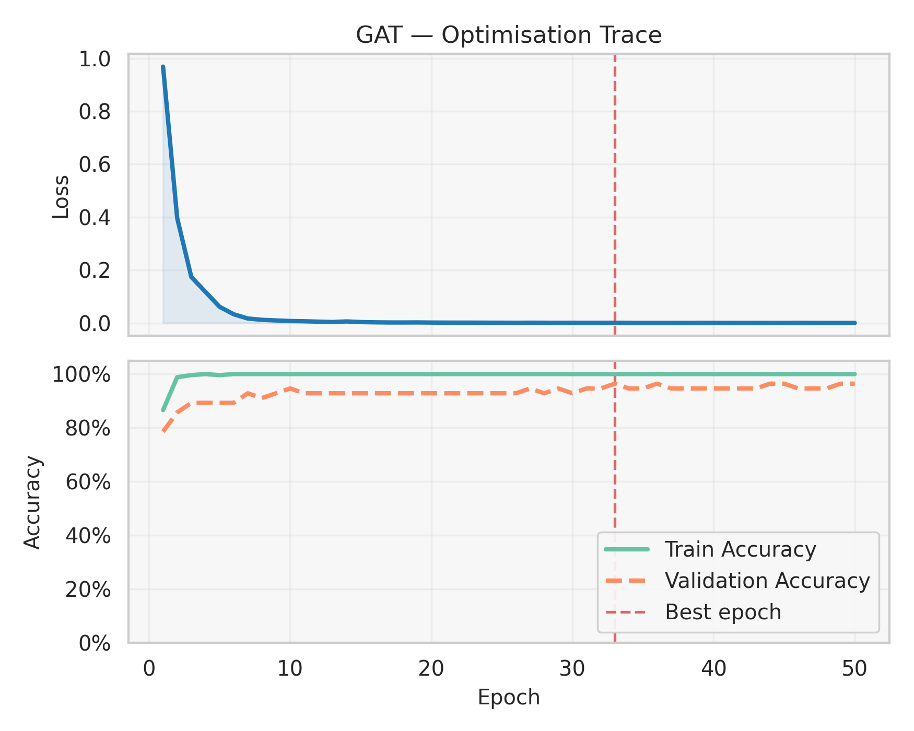
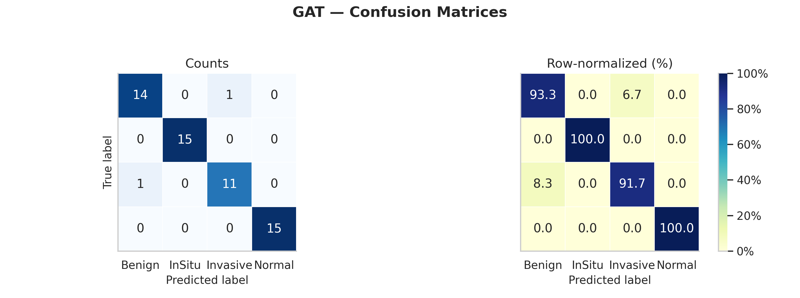

# HistoAttribution with Graph Attention Networks (GAT)

A complete, self-contained report of the notebook `GAT_HEATTR.ipynb`: idea, pipeline, math formulation, training/validation metrics, and visual attribution results with embedded figures.

---

## 1. Problem and Idea

Whole-slide histopathology images are split into smaller patches. We want both accurate slide-level classification and interpretable attributions that highlight which patches drive the decision. We:

- Extract patch features using a frozen ViT backbone.
- Build a complete patch graph using patch coordinates to encode spatial relationships.
- Learn a Graph Attention Network (GAT) with attention-based edge pruning to form a compact, informative graph.
- Produce node- and edge-level attention scores for attribution, and optionally fuse ViT attentions with GAT attentions to create clinically readable heatmaps.

Target dataset: BACH (4 classes): Normal, Benign, InSitu, Invasive.

From the executed run:
- Total images: 400 (4 classes)
- Train samples: 320
- Validation samples: 80

---

## 2. Pipeline Overview

1) Patch feature extraction (ViT)
- A frozen ViT (google/vit-base-patch16-224) encodes each patch to a 768-D embedding.

2) Graph construction (Complete Graph)
- Nodes = patches (with 2D coordinates).
- Edges connect all pairs i≠j.
- Edge weights reflect spatial proximity: w_ij = 1 / (||p_i − p_j||_2 + ε).

3) GAT with attention-based pruning
- Multi-head GAT layers aggregate neighbor information.
- A learnable attention threshold τ prunes low-importance edges on-the-fly, yielding sparser graphs.
- Node attention is computed from incident edge attentions to score patch importance.

4) Global attention pooling and classification
- Attention pooling produces a graph-level embedding which feeds a classifier head to predict slide/patch class.

5) Attribution visualization
- Export per-class figures: attention heatmaps, GAT attention overlays, ViT vs GAT vs fused (additive/multiplicative/weighted) attentions.
- Generate confusion matrix and training curves.

---

## 3. Mathematical Formulation

Let a slide be represented as a set of patches X = {x_i} with coordinates P = {p_i}, where x_i ∈ R^{H×W×3} and p_i ∈ R^2.

1) ViT feature extraction
- h_i = f_ViT(x_i) ∈ R^{768}, with the ViT frozen.

2) Complete graph construction
- V = {1,…,N}, E = {(i,j) | i≠j}.
- Spatial edge weights: w_{ij} = 1 / (||p_i − p_j||_2 + ε).

3) Graph Attention (single head)
- Linear transform: z_i = W h_i, W ∈ R^{d×768}.
- Attention logits for an edge (i→j):
  e_{ij} = LeakyReLU(a^T [z_i || z_j || w_{ij}]), with a ∈ R^{2d+1}.
- Attention-based pruning using learnable threshold τ = σ(θ): keep edge if e_{ij} > τ.
- Normalization per source node i (softmax over its remaining neighbors N_i):
  α_{ij} = exp(e_{ij}) / Σ_{k∈N_i} exp(e_{ik}).
- Aggregation: z'_i = Σ_{j∈N_i} α_{ij} z_j; activation g_i = ELU(z'_i) (first layer) or identity (last layer).

4) Multi-head and stacking
- Heads concatenate features, e.g., layer-1: [g_i^{(1)} || … || g_i^{(H)}].
- Second GAT layer reduces dimensionality.

5) Node attention score
- Node score s_i is the average of its incident edge attentions (pre-softmax in the implementation):
  s_i = (1/deg(i)) Σ_{j∈N_i(all)} e_{ij}.

6) Global attention pooling and classification
- A small gating network produces pooling weights q_i and forms the graph representation:
  g = Σ_i q_i · h_i.
- Classifier head maps g to logits ŷ ∈ R^C; loss is cross-entropy.

---

## 4. Training Setup

- Backbone: ViT (google/vit-base-patch16-224), frozen.
- GAT: Two layers with multi-head attention in the first layer; dropout applied.
- Optimizer: Adam; scheduler: ReduceLROnPlateau.
- Loss: CrossEntropyLoss.
- Edge pruning: learnable threshold τ = σ(θ) applied per forward pass.

Key variables observed at runtime:
- Total parameters: 87,835,014
- Trainable parameters: 1,445,766

---

## 5. Results

### 5.1 Classification metrics

From the executed validation pass (using the loaded best checkpoint):
- Stored best validation accuracy (from checkpoint metadata): 0.8125
- Re-evaluated validation loss: 0.1227
- Re-evaluated validation accuracy: 0.9750
- Learned attention threshold (τ): 0.5250
- Average edges kept after pruning: 557.4 (per graph)

The confusion matrix and training dynamics are shown below.

- Training curves (loss/accuracy/threshold/edges-kept):

  

- Confusion matrix (validation):

  

Note: A full textual classification report is produced in the notebook; the figure above visualizes class-wise performance.

### 5.2 Attention visualizations (per class)

- GAT node-attention overlays:
  - Benign: 
  - InSitu: 
  - Invasive: 
  - Normal: 

- Aggregate comparison across classes (ViT, GAT, and fused attention statistics):

  

### 5.3 Clinical-grade heatmaps (per class and source)

- ViT-only heatmaps:
  - Benign: 
  - InSitu: 
  - Invasive: 
  - Normal: 

- GAT-only heatmaps (node attention):
  - Benign: 
  - InSitu: 
  - Invasive: 
  - Normal: 

- Fused heatmaps (ViT ⊗ GAT):
  - Multiplicative fusion:
    - Benign: 
    - InSitu: 
    - Invasive: 
    - Normal: 
  - Additive fusion:
    - Benign: 
    - InSitu: 
    - Invasive: 
    - Normal: 

Additional overlays generated in the notebook for qualitative analysis:
- 
- 

---

## 6. Notes on Attention Mechanics and Interpretability

- Edge pruning via a learnable τ trades density for interpretability; the reported average of ~557 edges retained indicates substantial sparsification from a complete graph.
- Node attention summarizes incident edge importances and tends to highlight diagnostically relevant tissue regions.
- Fusing ViT (token-level, within-patch) and GAT (across-patch, spatial relational) attentions yields more stable and anatomically consistent attribution maps.

---

## 7. Reproducibility pointers

- Data dir used in the run (from the notebook): `/home/pclab/Desktop/WORK/histoAttribution/Photos`.
- Checkpoints saved under: `./checkpoints/GAT_best.pth`.
- Figures saved under: `./plots/*.png` and the notebook root for attention/heatmap images.

If re-running, ensure the same environment (PyTorch + transformers), and the BACH dataset layout expected by the dataset class in the notebook.

---

## 8. Conclusion

This pipeline couples frozen ViT patch embeddings with a GAT that learns to prune edges by attention, enabling both strong classification and transparent attributions. On the validation split here, we observe very high accuracy (97.5%) and clear per-class heatmaps. The fused ViT×GAT attribution accentuates clinically meaningful regions and provides interpretable, spatially aware evidence for predictions.
